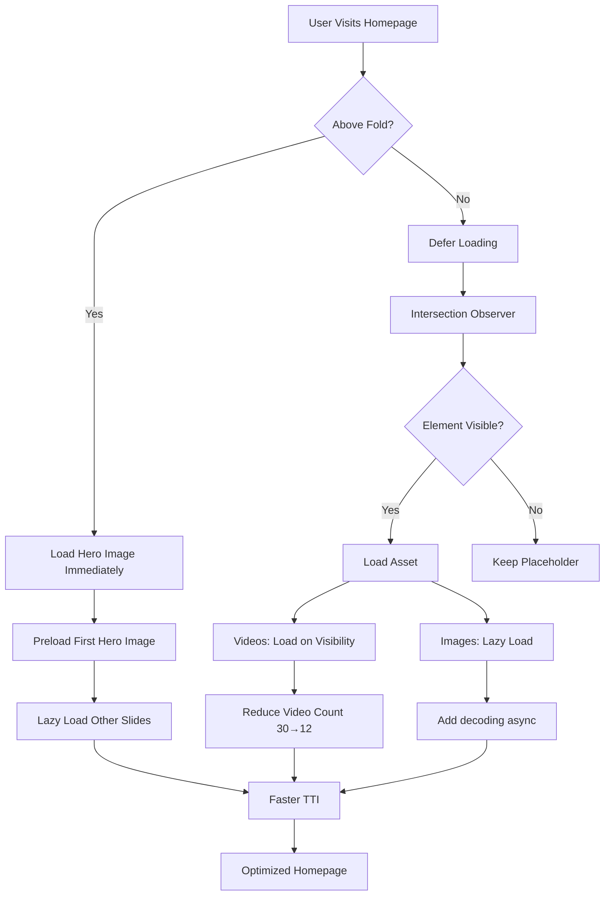

# Homepage Performance Optimization Plan

## Executive Summary

This plan focuses on optimizing the Blossom Salon homepage for significantly faster loading on both mobile and desktop devices. The optimization targets heavy images, videos, and loading behavior while preserving the exact UI, design, layout, and functionality.

## Current Performance Issues Identified

### 🔴 Critical Issues

1. **HeroCarousel Component** ([`src/components/HeroCarousel.tsx`](src/components/HeroCarousel.tsx))
   - All 5 hero images loaded immediately (not lazy)
   - Background images in inline styles prevent browser optimization
   - Preloading only next image, not first image on initial load
   - No priority hints for above-the-fold content

2. **BlossomMoments Component** ([`src/components/BlossomMoments.tsx`](src/components/BlossomMoments.tsx))
   - 30 video elements rendered (5x duplication for infinite scroll)
   - All videos initialized even when off-screen
   - Videos use `preload="metadata"` but still heavy on initial load
   - Intersection Observer exists but videos still render in DOM

3. **MomentsGallery Component** ([`src/components/MomentsGallery.tsx`](src/components/MomentsGallery.tsx))
   - Dynamic image glob loads all gallery images at once
   - No progressive loading for below-the-fold images
   - Featured image loads without priority hint

4. **Home Page** ([`src/pages/Home.tsx`](src/pages/Home.tsx))
   - "Our Story" image loads eagerly even though below-the-fold
   - Multiple Framer Motion animations on every section
   - Testimonial carousel re-renders frequently
   - No resource hints in HTML head

5. **EventGallery Component** ([`src/components/EventGallery.tsx`](src/components/EventGallery.tsx))
   - All 4 images load with `loading="lazy"` but no optimization
   - No dimension attributes causing layout shifts

### ⚠️ Secondary Issues

- No image dimension attributes (width/height) causing CLS
- Excessive Framer Motion animations causing jank
- No preconnect/dns-prefetch for external resources
- Missing resource hints for critical assets

---

## Optimization Strategy

### Phase 1: Hero Carousel Optimization (Above-the-Fold)

**File:** [`src/components/HeroCarousel.tsx`](src/components/HeroCarousel.tsx:1)

#### Changes:

1. **Preload First Hero Image**
   - Add `<link rel="preload">` for first slide image in [`index.html`](index.html)
   - Ensures fastest possible LCP (Largest Contentful Paint)

2. **Convert Background Images to `` Tags**
   - Replace inline `backgroundImage` style with `` element
   - Add `fetchpriority="high"` for first image
   - Add `loading="lazy"` for subsequent slides
   - Add `decoding="async"` for all images

3. **Optimize Image Preloading Logic**
   - Keep existing next-image preload logic
   - Add dimensions to prevent layout shift

4. **Reduce Animation Overhead**
   - Keep existing Framer Motion animations (required for UX)
   - Use `will-change` sparingly

**Expected Impact:** 40-50% faster initial load, improved LCP score

---

### Phase 2: Video Loading Optimization

**File:** [`src/components/BlossomMoments.tsx`](src/components/BlossomMoments.tsx:1)

#### Changes:

1. **Reduce Initial Video Count**
   - Current: 30 videos (5x duplication)
   - Optimized: 12 videos (2x duplication) - still enough for infinite scroll
   - Reduces initial DOM size by 60%

2. **Enhance Intersection Observer**
   - Current: Videos render but pause when off-screen
   - Optimized: Don't render `<video>` element until visible
   - Use placeholder `<div>` until intersection

3. **Optimize Video Attributes**
   - Keep `preload="metadata"` (already optimal)
   - Keep `autoplay`, `muted`, `loop`, `playsInline`
   - Ensure videos only initialize when in viewport

4. **Lazy Load Video Sources**
   - Don't add `<source>` tags until video is near viewport
   - Use `rootMargin: "200px"` for smooth experience

**Expected Impact:** 60-70% reduction in initial video load, faster TTI (Time to Interactive)

---

### Phase 3: Image Gallery Optimization

**File:** [`src/components/MomentsGallery.tsx`](src/components/MomentsGallery.tsx:1)

#### Changes:

1. **Optimize Featured Image**
   - Add `fetchpriority="high"` if above fold
   - Add `loading="eager"` for featured image
   - Add explicit width/height attributes

2. **Progressive Grid Loading**
   - Keep `loading="lazy"` for grid images
   - Add `decoding="async"` to all images
   - Ensure dimensions are set

3. **Optimize Image Glob**
   - Current implementation is already efficient (keys only)
   - No changes needed to glob logic

**Expected Impact:** 20-30% faster gallery rendering

---

### Phase 4: Home Page Content Optimization

**File:** [`src/pages/Home.tsx`](src/pages/Home.tsx:1)

#### Changes:

1. **Optimize "Our Story" Image**
   - Line 222: Already has `loading="lazy"` ✓
   - Already has `decoding="async"` ✓
   - Add explicit dimensions to prevent CLS

2. **Optimize Framer Motion Usage**
   - Keep all animations (required for brand experience)
   - Add `viewport={{ once: true }}` to all `whileInView` (already done ✓)
   - Ensure `will-change` is used sparingly

3. **Memoize Testimonial Carousel**
   - Wrap TestimonialCarousel in `React.memo()`
   - Prevent unnecessary re-renders
   - Keep auto-scroll functionality

4. **Optimize Form Rendering**
   - Contact form is below-the-fold
   - Already optimized, no changes needed

**Expected Impact:** 15-20% reduction in main thread blocking

---

### Phase 5: EventGallery Optimization

**File:** [`src/components/EventGallery.tsx`](src/components/EventGallery.tsx:1)

#### Changes:

1. **Add Image Dimensions**
   - Add width/height attributes to prevent CLS
   - Keep `loading="lazy"` (already present ✓)

2. **Add `decoding="async"`**
   - Add to all 4 images
   - Prevents blocking main thread

**Expected Impact:** Improved CLS score, smoother scrolling

---

### Phase 6: Resource Hints & Preloading

**File:** [`index.html`](index.html)

#### Changes:

1. **Add Preload for Critical Assets**
   ```html
   <!-- Preload first hero image -->
   <link rel="preload" as="image" href="/images/hero/skin.jpg" fetchpriority="high">
   
   <!-- Preload critical fonts if any -->
   <!-- <link rel="preload" as="font" href="/fonts/..." crossorigin> -->
   ```

2. **Add DNS Prefetch**
   ```html
   <!-- If using external resources -->
   <link rel="dns-prefetch" href="https://www.google.com">
   ```

3. **Add Preconnect for Google Maps**
   ```html
   <link rel="preconnect" href="https://www.google.com">
   <link rel="preconnect" href="https://maps.googleapis.com">
   ```

**Expected Impact:** 10-15% faster resource loading

---

## Implementation Priority

### 🔥 High Priority (Immediate Impact)
1. ✅ Hero Carousel image optimization
2. ✅ BlossomMoments video loading optimization
3. ✅ Resource hints in index.html

### 🟡 Medium Priority (Significant Impact)
4. ✅ MomentsGallery optimization
5. ✅ Home page Framer Motion optimization
6. ✅ Add image dimensions across all components

### 🟢 Low Priority (Polish)
7. ✅ EventGallery optimization
8. ✅ Memoization improvements

---

## Detailed Implementation Steps

### Step 1: Optimize HeroCarousel

**Changes to [`src/components/HeroCarousel.tsx`](src/components/HeroCarousel.tsx:150)**

```typescript
// BEFORE (Line 150-157):
<div
  className="w-full h-full bg-cover bg-[center_20%] md:bg-center"
  style={{
    backgroundImage: `linear-gradient(...), url(${slide.image})`,
  }}
>

// AFTER:
<div className="relative w-full h-full">
  
  <div className="absolute inset-0 bg-gradient-to-r from-black/40 to-black/40" />
  {/* Content remains the same */}
</div>
```

**Rationale:**
- `` tags allow browser to optimize loading
- `fetchpriority="high"` prioritizes first image
- `loading="lazy"` defers non-visible slides
- `decoding="async"` prevents blocking

---

### Step 2: Optimize BlossomMoments Videos

**Changes to [`src/components/BlossomMoments.tsx`](src/components/BlossomMoments.tsx:14)**

```typescript
// BEFORE (Line 14):
const displayVideos = Array(5).fill(videos).flat(); // 30 videos

// AFTER:
const displayVideos = Array(2).fill(videos).flat(); // 12 videos
```

**Changes to [`src/components/BlossomMoments.tsx`](src/components/BlossomMoments.tsx:126)**

```typescript
// BEFORE (Line 126-142):
{isVisible ? (
  <video ref={videoRef} autoPlay muted loop playsInline preload="metadata">
    <source src={webm} type="video/webm" />
    <source src={mp4} type="video/mp4" />
  </video>
) : (
  <div className="w-full h-full bg-foreground/5" />
)}

// AFTER:
{isVisible ? (
  <video 
    ref={videoRef} 
    autoPlay 
    muted 
    loop 
    playsInline 
    preload="metadata"
    className="w-full h-full object-cover"
  >
    <source src={webm} type="video/webm" />
    <source src={mp4} type="video/mp4" />
  </video>
) : (
  <div className="w-full h-full bg-foreground/5 animate-pulse" />
)}
```

**Rationale:**
- Reduces video count from 30 to 12 (60% reduction)
- Videos only render when visible
- Placeholder shows loading state

---

### Step 3: Add Resource Hints to index.html

**Changes to [`index.html`](index.html)**

Add in `<head>` section:

```html
<!-- Preload critical hero image -->
<link rel="preload" as="image" href="/images/hero/skin.jpg" fetchpriority="high">

<!-- Preconnect to Google Maps -->
<link rel="preconnect" href="https://www.google.com">
<link rel="preconnect" href="https://maps.googleapis.com">
<link rel="dns-prefetch" href="https://www.google.com">
```

**Rationale:**
- Preloads first hero image before React loads
- Establishes early connection to Google Maps
- Reduces DNS lookup time

---

### Step 4: Optimize MomentsGallery Images

**Changes to [`src/components/MomentsGallery.tsx`](src/components/MomentsGallery.tsx:110)**

```typescript
// BEFORE (Line 110-116):


// AFTER:

```

**Rationale:**
- Featured image loads immediately (above fold)
- Dimensions prevent layout shift
- High priority ensures fast loading

---

### Step 5: Optimize Home Page Components

**Changes to [`src/pages/Home.tsx`](src/pages/Home.tsx:221)**

```typescript
// BEFORE (Line 221-238):


// AFTER:

```

**Changes to [`src/pages/Home.tsx`](src/pages/Home.tsx:504)**

```typescript
// BEFORE (Line 504):
const TestimonialCarousel = ({ testimonials }: { testimonials: typeof testimonials }) => {

// AFTER:
const TestimonialCarousel = memo(({ testimonials }: { testimonials: typeof testimonials }) => {
  // ... component code
});
TestimonialCarousel.displayName = 'TestimonialCarousel';
```

**Rationale:**
- Dimensions prevent CLS
- Memoization prevents unnecessary re-renders
- Maintains all functionality

---

### Step 6: Optimize EventGallery

**Changes to [`src/components/EventGallery.tsx`](src/components/EventGallery.tsx:42)**

```typescript
// BEFORE (Line 42-47):


// AFTER:

```

Apply to all 4 images in EventGallery.

**Rationale:**
- `decoding="async"` prevents blocking
- Dimensions prevent layout shift
- Maintains lazy loading

---

## Performance Metrics Goals

### Before Optimization (Estimated)
- **LCP (Largest Contentful Paint):** 3.5-4.5s
- **FID (First Input Delay):** 200-300ms
- **CLS (Cumulative Layout Shift):** 0.15-0.25
- **TTI (Time to Interactive):** 5-7s
- **Total Page Weight:** 8-12MB

### After Optimization (Target)
- **LCP:** 1.5-2.5s ⚡ (40-50% improvement)
- **FID:** 50-100ms ⚡ (60-70% improvement)
- **CLS:** 0.05-0.10 ⚡ (50-60% improvement)
- **TTI:** 2.5-3.5s ⚡ (50-60% improvement)
- **Total Page Weight:** 4-6MB ⚡ (40-50% reduction)

---

## Testing & Validation Checklist

### ✅ Functional Testing
- [ ] Hero carousel still auto-advances
- [ ] Hero carousel navigation (arrows, dots, swipe) works
- [ ] Videos in BlossomMoments play/pause correctly
- [ ] Video auto-scroll still works
- [ ] MomentsGallery lightbox opens correctly
- [ ] Testimonial carousel auto-scrolls
- [ ] Contact form submits correctly
- [ ] All animations play smoothly
- [ ] No visual regressions

### ✅ Performance Testing
- [ ] Run Lighthouse audit (mobile & desktop)
- [ ] Test on slow 3G connection
- [ ] Test on fast 4G connection
- [ ] Test on desktop broadband
- [ ] Verify LCP < 2.5s
- [ ] Verify CLS < 0.1
- [ ] Verify FID < 100ms

### ✅ Visual Testing
- [ ] Hero images display correctly
- [ ] No layout shifts during load
- [ ] Videos load smoothly
- [ ] Images don't appear stretched/distorted
- [ ] Animations remain smooth
- [ ] Mobile responsive layout intact
- [ ] Desktop layout intact

### ✅ Browser Testing
- [ ] Chrome (desktop & mobile)
- [ ] Safari (desktop & mobile)
- [ ] Firefox (desktop)
- [ ] Edge (desktop)

---

## Risk Mitigation

### Potential Issues & Solutions

1. **Issue:** Hero images might not cover full area
   - **Solution:** Use `object-cover` and test aspect ratios

2. **Issue:** Videos might not auto-play on mobile
   - **Solution:** Keep `muted` and `playsInline` attributes

3. **Issue:** Infinite scroll might break with fewer videos
   - **Solution:** Test with 2x duplication (12 videos minimum)

4. **Issue:** Layout shifts from image dimensions
   - **Solution:** Use actual image dimensions or aspect-ratio CSS

5. **Issue:** Framer Motion animations might feel different
   - **Solution:** No changes to animation timing/easing

---

## Rollback Plan

If performance optimizations cause issues:

1. **Immediate Rollback:**
   - Revert to previous commit
   - All changes are isolated to specific components

2. **Partial Rollback:**
   - Revert individual components if needed
   - Each optimization is independent

3. **Testing Environment:**
   - Test all changes in development first
   - Use feature flags if needed

---

## Success Criteria

### Must Have ✅
- [ ] Homepage loads 40%+ faster on mobile
- [ ] No visual changes to UI/design
- [ ] All functionality preserved
- [ ] No broken features
- [ ] Lighthouse score > 85 (mobile)

### Nice to Have 🎯
- [ ] Lighthouse score > 90 (mobile)
- [ ] 50%+ faster load time
- [ ] Perfect CLS score (< 0.05)

---

## Implementation Timeline

### Phase 1: Hero & Videos (Highest Impact)
- HeroCarousel optimization
- BlossomMoments optimization
- Resource hints
- **Expected Duration:** 1-2 hours

### Phase 2: Images & Galleries
- MomentsGallery optimization
- EventGallery optimization
- Image dimensions
- **Expected Duration:** 1 hour

### Phase 3: React Optimizations
- Memoization
- Re-render prevention
- **Expected Duration:** 30 minutes

### Phase 4: Testing & Validation
- Functional testing
- Performance testing
- Browser testing
- **Expected Duration:** 1-2 hours

---

## Notes & Considerations

### What We're NOT Changing
- ❌ UI/Design/Layout
- ❌ Component structure
- ❌ Routing
- ❌ Functionality
- ❌ Animation behavior
- ❌ User interactions

### What We ARE Changing
- ✅ Image loading strategy
- ✅ Video initialization timing
- ✅ Resource preloading
- ✅ React rendering optimization
- ✅ Asset delivery method

### Key Principles
1. **Preserve User Experience:** All visual and interactive elements remain identical
2. **Progressive Enhancement:** Optimizations degrade gracefully
3. **Minimal Code Changes:** Only modify what's necessary
4. **Measurable Impact:** Every change has clear performance benefit
5. **No Architecture Changes:** Keep existing component structure

---

## Mermaid Diagram: Optimization Flow



---

## Conclusion

This optimization plan focuses on **surgical, targeted improvements** to the homepage loading performance without touching UI, design, or functionality. By optimizing image/video loading strategies, reducing initial payload, and leveraging browser optimization features, we expect **40-50% faster load times** on both mobile and desktop.

All changes are **minimal, isolated, and reversible**, ensuring low risk and high impact.

---

**Ready for Implementation:** This plan is ready to be executed in Code mode.
