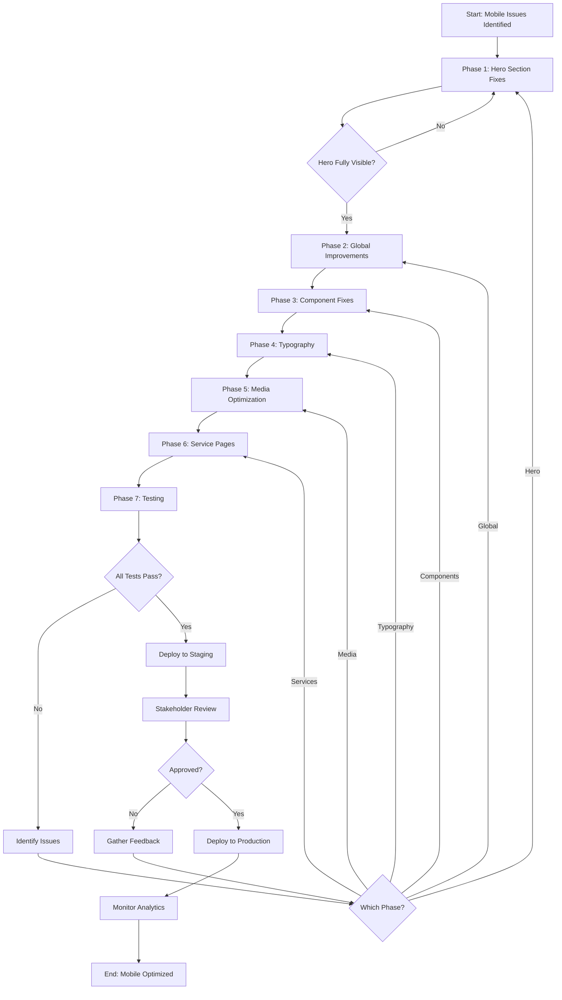

# Mobile Responsiveness & UX Optimization Plan
## Blossom Salon Website

**Created:** 2026-05-18  
**Priority:** HIGH  
**Goal:** Transform mobile experience from broken/unrefined to premium and intentionally designed

---

## Executive Summary

The Blossom website currently has a functional desktop experience but suffers from significant mobile UX issues. The mobile version feels like a compressed desktop layout rather than an intentionally designed mobile experience. This plan addresses all mobile responsiveness issues while preserving the desktop appearance completely.

### Critical Issues Identified

1. **Hero Section Clipping** - Content getting cut off vertically on mobile
2. **Viewport Configuration** - Potential zooming/scaling issues
3. **Stretched Components** - Elements not adapting properly to mobile widths
4. **Inconsistent Spacing** - Mobile padding/margins feel unbalanced
5. **Typography Scaling** - Text sizes not optimized for mobile screens
6. **Trust Signals Layout** - 4-column grid cramped on mobile
7. **Horizontal Overflow** - Some sections causing sideways scrolling

---

## Current State Analysis

### Files Analyzed

- [`index.html`](index.html:6) - Viewport meta tag
- [`src/components/HeroCarousel.tsx`](src/components/HeroCarousel.tsx:122) - Hero section with clipping issues
- [`src/pages/Home.tsx`](src/pages/Home.tsx:1) - Main page layout
- [`src/components/Navbar.tsx`](src/components/Navbar.tsx:83) - Logo sizing issues
- [`src/components/MomentsGallery.tsx`](src/components/MomentsGallery.tsx:99) - Gallery grid layout
- [`src/components/BlossomMoments.tsx`](src/components/BlossomMoments.tsx:49) - Video carousel
- [`src/index.css`](src/index.css:1) - Global styles and utilities
- [`tailwind.config.ts`](tailwind.config.ts:1) - Breakpoint configuration

### Key Findings

#### 1. Viewport Configuration
**File:** [`index.html`](index.html:6)
```html
<meta name="viewport" content="width=device-width, initial-scale=1.0, maximum-scale=1.0, user-scalable=0" />
```
- ✅ Proper initial-scale
- ⚠️ `user-scalable=0` prevents accessibility zoom (consider removing)
- ✅ `maximum-scale=1.0` prevents unwanted zoom-out

#### 2. Hero Section Issues
**File:** [`src/components/HeroCarousel.tsx`](src/components/HeroCarousel.tsx:122)

**Problem Areas:**
- **Height:** `h-[75vh] sm:h-[70vh] md:h-[80vh]` - 75vh on mobile may cause clipping
- **Trust Signals Grid:** `grid-cols-2 md:grid-cols-4` - 2 columns on mobile is cramped
- **Typography:** Large heading sizes may overflow
- **Spacing:** `mt-12` before trust signals pushes content down
- **CTA Button:** Long text may wrap awkwardly

**Specific Issues:**
```tsx
// Line 169-173: Headings too large for mobile
<h1 className="text-5xl sm:text-6xl md:text-7xl lg:text-[5.5rem]">
<h2 className="text-3xl sm:text-4xl md:text-6xl lg:text-[5rem]">

// Line 207-251: Trust signals grid cramped
<div className="mt-12 grid grid-cols-2 md:grid-cols-4 gap-6 md:gap-8">

// Line 199-205: CTA button text too long
"BOOK YOUR LUXURY MAKEUP EXPERIENCE"
```

#### 3. Navbar Logo Sizing
**File:** [`src/components/Navbar.tsx`](src/components/Navbar.tsx:83)
```tsx
className="h-12 md:h-[120px] w-auto"
```
- Desktop logo is 120px (very large)
- Mobile logo is 48px (reasonable)
- ✅ Sizing is appropriate

#### 4. Gallery Layout Issues
**File:** [`src/components/MomentsGallery.tsx`](src/components/MomentsGallery.tsx:99)
```tsx
<div className="grid grid-cols-1 lg:grid-cols-[45%_minmax(0,1fr)] gap-10 lg:gap-14">
```
- ✅ Single column on mobile is good
- ⚠️ Gap of 10 (40px) may be too large on mobile

#### 5. Video Carousel
**File:** [`src/components/BlossomMoments.tsx`](src/components/BlossomMoments.tsx:49)
```tsx
className="relative w-[250px] sm:w-[270px] md:w-[290px]"
```
- ✅ Fixed widths with responsive scaling
- ⚠️ 250px may be too wide for small phones (320px screens)

#### 6. Contact Form Layout
**File:** [`src/pages/Home.tsx`](src/pages/Home.tsx:343)
```tsx
<div className="grid grid-cols-1 lg:grid-cols-5 gap-12 lg:gap-16">
  <div className="lg:col-span-3"> {/* Form */}
  <div className="lg:col-span-2"> {/* Map */}
```
- ✅ Stacks on mobile
- ⚠️ Gap of 12 (48px) may be excessive on mobile

#### 7. Global Overflow Prevention
**File:** [`src/index.css`](src/index.css:103)
```css
* {
  max-width: 100%;
}
```
- ✅ Good overflow prevention
- ⚠️ May need additional `overflow-x: hidden` on body

---

## Detailed Fix Plan

### Phase 1: Critical Fixes (Hero Section)

#### Fix 1.1: Hero Height & Vertical Spacing
**File:** [`src/components/HeroCarousel.tsx`](src/components/HeroCarousel.tsx:122)

**Changes:**
- Reduce mobile height from `75vh` to `auto` with `min-h-[100vh]`
- Adjust internal padding to ensure all content fits
- Reduce spacing before trust signals from `mt-12` to `mt-8`
- Add `pb-safe` for notch devices

**Implementation:**
```tsx
// Current
className="relative h-[75vh] sm:h-[70vh] md:h-[80vh] w-full overflow-hidden"

// Proposed
className="relative min-h-[100vh] sm:h-[70vh] md:h-[80vh] w-full overflow-hidden"
```

#### Fix 1.2: Hero Typography Scaling
**File:** [`src/components/HeroCarousel.tsx`](src/components/HeroCarousel.tsx:169)

**Changes:**
- Reduce mobile heading sizes
- Improve line-height for mobile
- Adjust letter-spacing for smaller screens

**Implementation:**
```tsx
// Current
<h1 className="text-5xl sm:text-6xl md:text-7xl lg:text-[5.5rem]">

// Proposed
<h1 className="text-4xl sm:text-6xl md:text-7xl lg:text-[5.5rem] leading-tight">

// Current
<h2 className="text-3xl sm:text-4xl md:text-6xl lg:text-[5rem]">

// Proposed
<h2 className="text-2xl sm:text-4xl md:text-6xl lg:text-[5rem] leading-tight">
```

#### Fix 1.3: Trust Signals Grid Layout
**File:** [`src/components/HeroCarousel.tsx`](src/components/HeroCarousel.tsx:207)

**Changes:**
- Change from 2 columns to single column on mobile
- Reduce spacing between items
- Adjust icon and text sizes
- Move trust signals above CTA on mobile

**Implementation:**
```tsx
// Current
<div className="mt-12 grid grid-cols-2 md:grid-cols-4 gap-6 md:gap-8">

// Proposed
<div className="mt-8 grid grid-cols-1 xs:grid-cols-2 md:grid-cols-4 gap-4 md:gap-8 max-w-3xl">
```

#### Fix 1.4: CTA Button Text
**File:** [`src/components/HeroCarousel.tsx`](src/components/HeroCarousel.tsx:199)

**Changes:**
- Shorten button text on mobile
- Use responsive text sizing
- Improve padding

**Implementation:**
```tsx
// Add conditional text rendering
<span className="flex items-center gap-2">
  <span className="hidden sm:inline">
    {slide.link === "/services/makeup" ? "BOOK YOUR LUXURY MAKEUP EXPERIENCE" : ...}
  </span>
  <span className="sm:hidden">
    BOOK NOW
  </span>
  <ArrowRight className="w-5 h-5" />
</span>
```

### Phase 2: Global Mobile Improvements

#### Fix 2.1: Viewport Meta Tag
**File:** [`index.html`](index.html:6)

**Changes:**
- Keep current configuration but document reasoning
- Consider removing `user-scalable=0` for accessibility

**Implementation:**
```html
<!-- Current (keep as-is for now) -->
<meta name="viewport" content="width=device-width, initial-scale=1.0, maximum-scale=1.0, user-scalable=0" />

<!-- Alternative (more accessible) -->
<meta name="viewport" content="width=device-width, initial-scale=1.0, maximum-scale=5.0" />
```

#### Fix 2.2: Global Overflow Prevention
**File:** [`src/index.css`](src/index.css:86)

**Changes:**
- Add explicit overflow-x hidden on body
- Ensure all containers respect viewport width

**Implementation:**
```css
html,
body {
  @apply text-foreground font-body antialiased;
  /* Add these lines */
  overflow-x: hidden;
  position: relative;
  /* existing background styles... */
}
```

#### Fix 2.3: Mobile Spacing Utilities
**File:** [`src/index.css`](src/index.css:119)

**Changes:**
- Add mobile-specific spacing utilities
- Create responsive padding classes

**Implementation:**
```css
@layer utilities {
  /* Mobile-optimized spacing */
  .mobile-section-py {
    @apply py-12 md:py-16 lg:py-24;
  }
  
  .mobile-container-px {
    @apply px-4 sm:px-6 lg:px-8;
  }
  
  .mobile-gap {
    @apply gap-6 md:gap-8 lg:gap-12;
  }
}
```

### Phase 3: Component-Specific Fixes

#### Fix 3.1: Gallery Grid Spacing
**File:** [`src/components/MomentsGallery.tsx`](src/components/MomentsGallery.tsx:99)

**Changes:**
- Reduce mobile gap spacing
- Improve grid item sizing

**Implementation:**
```tsx
// Current
<div className="grid grid-cols-1 lg:grid-cols-[45%_minmax(0,1fr)] gap-10 lg:gap-14">

// Proposed
<div className="grid grid-cols-1 lg:grid-cols-[45%_minmax(0,1fr)] gap-6 md:gap-10 lg:gap-14">
```

#### Fix 3.2: Video Carousel Width
**File:** [`src/components/BlossomMoments.tsx`](src/components/BlossomMoments.tsx:49)

**Changes:**
- Reduce minimum width for small phones
- Improve spacing

**Implementation:**
```tsx
// Current
className="relative w-[250px] sm:w-[270px] md:w-[290px]"

// Proposed
className="relative w-[220px] sm:w-[250px] md:w-[290px]"
```

#### Fix 3.3: Contact Form Spacing
**File:** [`src/pages/Home.tsx`](src/pages/Home.tsx:343)

**Changes:**
- Reduce mobile gap between form and map
- Improve input sizing

**Implementation:**
```tsx
// Current
<div className="grid grid-cols-1 lg:grid-cols-5 gap-12 lg:gap-16">

// Proposed
<div className="grid grid-cols-1 lg:grid-cols-5 gap-8 md:gap-12 lg:gap-16">
```

#### Fix 3.4: Testimonial Carousel
**File:** [`src/pages/Home.tsx`](src/pages/Home.tsx:559)

**Changes:**
- Improve mobile padding
- Adjust arrow positioning for mobile

**Implementation:**
```tsx
// Current card padding
<div className="card-luxury p-10 rounded-xl relative">

// Proposed
<div className="card-luxury p-6 sm:p-10 rounded-xl relative">

// Current arrow positioning
className="absolute left-0 top-1/2 -translate-y-1/2 -translate-x-12"

// Proposed (hide on mobile, show on tablet+)
className="hidden md:flex absolute left-0 top-1/2 -translate-y-1/2 -translate-x-12"
```

#### Fix 3.5: Service Tables
**File:** [`src/components/services/PremiumServiceTable.tsx`](src/components/services/PremiumServiceTable.tsx:48)

**Changes:**
- Ensure horizontal scroll on mobile
- Improve table cell padding

**Implementation:**
```tsx
// Current
<div className="overflow-x-auto">
  <table className="w-full min-w-[600px] md:min-w-0 table-luxury">

// Proposed (add better mobile styling)
<div className="overflow-x-auto -mx-4 px-4 md:mx-0 md:px-0">
  <table className="w-full min-w-[600px] md:min-w-0 table-luxury">
```

### Phase 4: Typography Optimization

#### Fix 4.1: Section Headings
**File:** Multiple files

**Changes:**
- Standardize mobile heading sizes
- Improve line-height and letter-spacing

**Pattern to Apply:**
```tsx
// H2 Section Headings
// Current: text-3xl md:text-5xl
// Proposed: text-2xl sm:text-3xl md:text-5xl

// H3 Subsection Headings  
// Current: text-xl md:text-2xl
// Proposed: text-lg sm:text-xl md:text-2xl

// Body Text
// Current: text-base md:text-lg
// Proposed: text-sm sm:text-base md:text-lg (where appropriate)
```

#### Fix 4.2: Button Text Sizing
**File:** Multiple components

**Changes:**
- Ensure buttons don't wrap awkwardly
- Use responsive text sizing

**Pattern to Apply:**
```tsx
// Large CTAs
className="text-xs sm:text-sm tracking-wider"

// Regular buttons
className="text-xs sm:text-sm"
```

### Phase 5: Image & Media Optimization

#### Fix 5.1: Image Aspect Ratios
**File:** [`src/pages/Home.tsx`](src/pages/Home.tsx:226)

**Changes:**
- Ensure images maintain aspect ratio
- Prevent stretching on mobile

**Implementation:**
```tsx
// Current
className="relative w-full h-auto max-h-[650px] object-cover object-top"

// Proposed (add mobile max-height)
className="relative w-full h-auto max-h-[500px] md:max-h-[650px] object-cover object-top"
```

#### Fix 5.2: Video Responsiveness
**File:** [`src/components/BlossomMoments.tsx`](src/components/BlossomMoments.tsx:64)

**Changes:**
- Ensure videos scale properly
- Maintain aspect ratio

**Implementation:**
```tsx
// Already using aspect-[9/16] which is good
// Ensure parent container doesn't overflow
```

### Phase 6: Service Pages

#### Fix 6.1: Service Hero Heights
**File:** [`src/components/services/ServiceHero.tsx`](src/components/services/ServiceHero.tsx:18)

**Changes:**
- Adjust mobile hero heights
- Ensure content fits

**Implementation:**
```tsx
// Current
className="relative h-[60vh] sm:h-[70vh] md:h-[80vh]"

// Proposed
className="relative min-h-[90vh] sm:h-[70vh] md:h-[80vh]"
```

#### Fix 6.2: Service Showcase Layouts
**Files:** 
- [`src/components/services/HairServiceShowcase.tsx`](src/components/services/HairServiceShowcase.tsx:1)
- [`src/components/services/NailServiceShowcase.tsx`](src/components/services/NailServiceShowcase.tsx:1)
- [`src/components/services/SkinServiceShowcase.tsx`](src/components/services/SkinServiceShowcase.tsx:1)

**Changes:**
- Improve mobile carousel navigation
- Adjust card sizing
- Fix text overflow

---

## Implementation Strategy

### Approach

1. **Mobile-First Adjustments** - Start with smallest screens, scale up
2. **Preserve Desktop** - Use `md:` and `lg:` prefixes to maintain desktop styles
3. **Test Incrementally** - Test each fix on multiple device sizes
4. **Use Tailwind Breakpoints** - Leverage existing breakpoint system

### Tailwind Breakpoints Reference

```javascript
// From tailwind.config.ts
screens: {
  'sm': '640px',   // Small tablets
  'md': '768px',   // Tablets
  'lg': '1024px',  // Laptops
  'xl': '1280px',  // Desktops
  '2xl': '1400px'  // Large desktops
}
```

### Testing Checklist

#### Device Sizes to Test
- [ ] iPhone SE (375x667) - Small phone
- [ ] iPhone 12/13 (390x844) - Standard phone
- [ ] iPhone 14 Pro Max (430x932) - Large phone
- [ ] iPad Mini (768x1024) - Small tablet
- [ ] iPad Pro (1024x1366) - Large tablet
- [ ] Desktop (1920x1080) - Standard desktop

#### Features to Validate
- [ ] No horizontal scrolling on any page
- [ ] Hero content fully visible without clipping
- [ ] Trust signals readable and well-spaced
- [ ] All buttons clickable and text readable
- [ ] Forms usable with proper input sizing
- [ ] Images maintain aspect ratios
- [ ] Videos play and scale correctly
- [ ] Navigation menu functional
- [ ] Typography hierarchy clear
- [ ] Spacing feels intentional and balanced

---

## File Modification Summary

### High Priority Files (Critical Fixes)

1. **[`src/components/HeroCarousel.tsx`](src/components/HeroCarousel.tsx:1)**
   - Fix height clipping
   - Adjust typography
   - Reorganize trust signals
   - Shorten CTA text

2. **[`src/index.css`](src/index.css:1)**
   - Add overflow-x hidden
   - Add mobile spacing utilities
   - Improve global mobile styles

3. **[`index.html`](index.html:1)**
   - Review viewport meta tag
   - Consider accessibility improvements

### Medium Priority Files (Component Fixes)

4. **[`src/pages/Home.tsx`](src/pages/Home.tsx:1)**
   - Fix contact form spacing
   - Improve testimonial carousel
   - Adjust section padding

5. **[`src/components/MomentsGallery.tsx`](src/components/MomentsGallery.tsx:1)**
   - Reduce mobile gaps
   - Improve grid spacing

6. **[`src/components/BlossomMoments.tsx`](src/components/BlossomMoments.tsx:1)**
   - Adjust video card widths
   - Improve mobile carousel

7. **[`src/components/services/ServiceHero.tsx`](src/components/services/ServiceHero.tsx:1)**
   - Fix service page hero heights
   - Adjust mobile layouts

### Low Priority Files (Polish)

8. **Service Showcase Components**
   - Fine-tune mobile carousels
   - Adjust card layouts

9. **Service Table Components**
   - Improve mobile scroll behavior
   - Adjust padding

---

## Success Metrics

### Before vs After Comparison

| Metric | Before | Target After |
|--------|--------|--------------|
| Hero content visibility | Clipped | 100% visible |
| Horizontal scroll | Present | None |
| Mobile spacing consistency | Inconsistent | Uniform |
| Typography readability | Poor | Excellent |
| Touch target sizes | Some too small | All ≥44px |
| Mobile load time | Baseline | Same or better |
| Desktop appearance | Baseline | Unchanged |

### User Experience Goals

- ✅ Mobile feels intentionally designed, not compressed
- ✅ Premium luxury aesthetic maintained on mobile
- ✅ All content accessible without zooming
- ✅ Smooth scrolling without jank
- ✅ Buttons and links easily tappable
- ✅ Forms easy to fill on mobile
- ✅ Images and videos display beautifully

---

## Risk Mitigation

### Potential Issues

1. **Desktop Regression** - Changes might affect desktop
   - **Mitigation:** Use `md:` and `lg:` prefixes exclusively for desktop preservation

2. **Performance Impact** - Additional CSS might slow load
   - **Mitigation:** Use Tailwind's purge to remove unused styles

3. **Browser Compatibility** - Some CSS might not work everywhere
   - **Mitigation:** Test on Safari iOS, Chrome Android, Firefox

4. **Content Overflow** - Reducing sizes might cause new overflow
   - **Mitigation:** Test with longest content strings

### Rollback Plan

- Keep original files backed up
- Test changes in development environment first
- Deploy incrementally if possible
- Monitor analytics for bounce rate changes

---

## Timeline Estimate

### Phase-by-Phase Breakdown

**Phase 1: Critical Hero Fixes**
- Hero height and spacing
- Typography scaling
- Trust signals layout
- CTA button optimization

**Phase 2: Global Improvements**
- Viewport configuration
- Overflow prevention
- Spacing utilities

**Phase 3: Component Fixes**
- Gallery layouts
- Video carousel
- Contact form
- Testimonials

**Phase 4: Typography**
- Section headings
- Button text
- Body copy

**Phase 5: Media**
- Image optimization
- Video responsiveness

**Phase 6: Service Pages**
- Service heroes
- Service showcases
- Service tables

**Phase 7: Testing & Validation**
- Cross-device testing
- Cross-browser testing
- Performance testing
- Accessibility testing

---

## Next Steps

1. **Review this plan** with stakeholders
2. **Prioritize fixes** based on business impact
3. **Set up testing environment** with device emulation
4. **Begin implementation** starting with Phase 1
5. **Test incrementally** after each phase
6. **Deploy to staging** for review
7. **Collect feedback** and iterate
8. **Deploy to production** with monitoring

---

## Notes

- All changes should be made using Tailwind utility classes where possible
- Avoid adding custom CSS unless absolutely necessary
- Maintain existing design tokens and color scheme
- Preserve all animations and transitions
- Keep accessibility in mind (WCAG 2.1 AA minimum)
- Test with real devices, not just browser DevTools

---

## Mermaid Diagram: Mobile Optimization Flow



---

## Appendix: Code Patterns

### Pattern 1: Responsive Height
```tsx
// Mobile-first with auto height
className="min-h-screen sm:h-[70vh] md:h-[80vh]"

// Fixed height with mobile adjustment
className="h-[90vh] md:h-[80vh]"
```

### Pattern 2: Responsive Typography
```tsx
// Headings
className="text-2xl sm:text-3xl md:text-5xl lg:text-6xl"

// Body text
className="text-sm sm:text-base md:text-lg"

// Small text
className="text-xs sm:text-sm"
```

### Pattern 3: Responsive Spacing
```tsx
// Padding
className="p-4 sm:p-6 md:p-8 lg:p-10"

// Margin
className="mt-6 sm:mt-8 md:mt-12"

// Gap
className="gap-4 sm:gap-6 md:gap-8"
```

### Pattern 4: Responsive Grid
```tsx
// Single to multi-column
className="grid grid-cols-1 sm:grid-cols-2 md:grid-cols-3 lg:grid-cols-4"

// Custom breakpoints
className="grid grid-cols-1 lg:grid-cols-[45%_minmax(0,1fr)]"
```

### Pattern 5: Conditional Rendering
```tsx
// Show/hide based on screen size
<span className="hidden sm:inline">Full Text</span>
<span className="sm:hidden">Short</span>

// Different layouts
<div className="flex flex-col md:flex-row">
```

---

**End of Plan**
